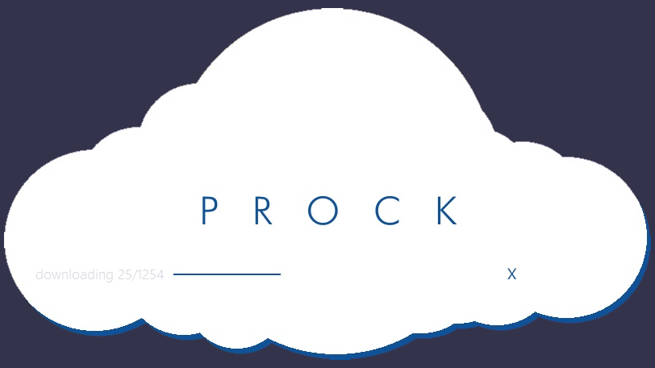

#Description
Self-updating launcher / patcher application created for the game PROCK using C#.

#Functionality
Creates and compares the checksum for local files against the server, downloads any missing or out-of-date files, and launches the newly updated program.

Currently specific to the game "PROCK", but can be altered to work with any program.

